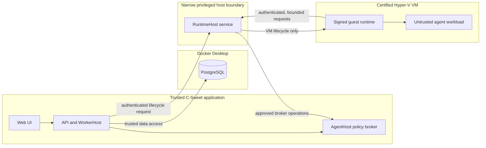
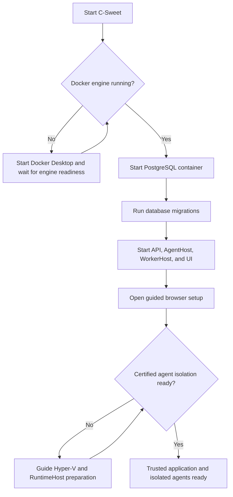

# C-Sweet security architecture overview

## Two different isolation responsibilities

C-Sweet uses Docker and hardware virtualization for different purposes. They are both required for the complete Windows development experience, but they are not interchangeable.

| Technology | Purpose | Trust classification |
|---|---|---|
| Docker Desktop | Runs trusted development infrastructure, currently including the Aspire-managed PostgreSQL database | Trusted infrastructure dependency |
| RuntimeHost | Performs a narrow set of privileged virtual-machine lifecycle operations | Trusted, privileged host service |
| Hyper-V Generation 2 VM | Contains imported and marketplace agent code | Untrusted-code security boundary |
| AgentHost | Applies policy and forwards approved MCP operations | Trusted, unprivileged broker |

Stopping Docker prevents the trusted application stack from starting because its database is unavailable. Losing Hyper-V readiness has a different result: C-Sweet remains available, but it refuses to execute untrusted agents. C-Sweet never substitutes a normal Docker container or host process for the certified VM boundary.

## Development startup and readiness

The application cannot display its browser-based setup wizard until trusted infrastructure is running. The source launcher therefore checks Docker before starting Aspire. Agent isolation is checked afterward because it can fail closed without taking down the rest of C-Sweet.

## Security properties

- Docker Desktop and the PostgreSQL container are trusted dependencies. They must be patched and operated like the rest of the host application infrastructure.
- Untrusted agents never receive the Docker socket, host filesystem mounts, database credentials, or direct private-network access.
- RuntimeHost has no public network listener and accepts authenticated, bounded local requests.
- The agent VM uses a signed base image, ephemeral writable state, no virtual network adapter, and an authenticated broker channel.
- If certification, signing, authentication, or provider readiness fails, untrusted execution stays disabled.
- Docker availability does not count as agent-isolation readiness, and Hyper-V availability does not replace Docker's application-infrastructure role.

## Deployment status

The Aspire AppHost is the supported path for current Windows development and end-to-end isolation testing. Docker Compose remains the intended packaging mechanism for trusted core services, but its legacy Docker-agent wiring must be removed before that topology represents the current security architecture. A containerized deployment must not mount the Docker daemon into WorkerHost or claim that a normal application container is an agent security boundary.

