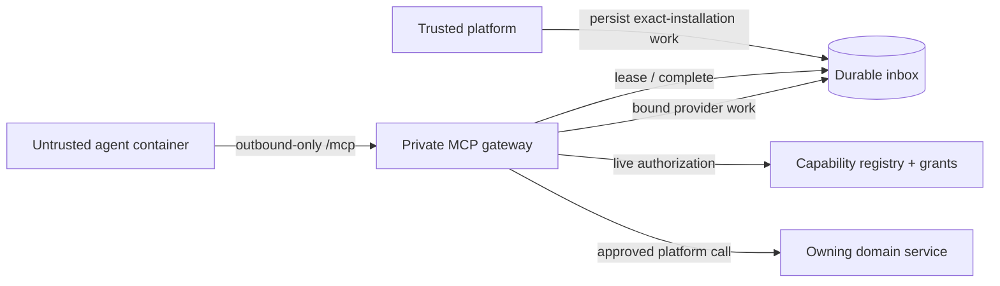
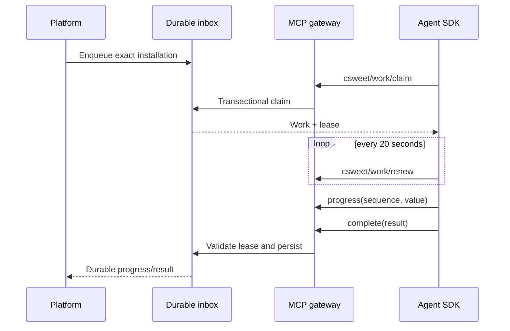
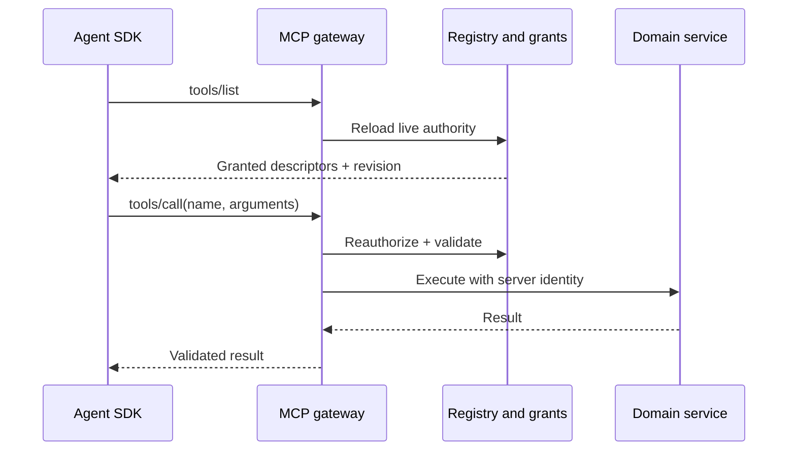
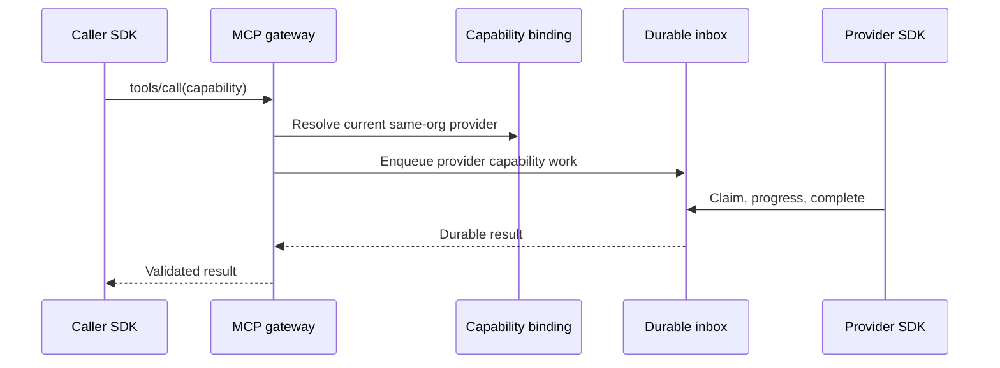

# MCP-only agent runtime

Status: canonical architecture for protocol v2.

## Goals and boundaries

C-Sweet runs installed agent and service code as untrusted workloads. Agents receive a small, transport-neutral SDK API while `CSweet.Agent.SDK` privately uses MCP Streamable HTTP. The SDK, not agent code, owns authentication, discovery, work leasing, retries, progress, cancellation, and shutdown. MCP is an implementation detail and may be replaced without changing an agent implementation.

The runtime does not provide arbitrary platform APIs, direct database access, credentials, a Docker socket, host mounts, inbound ports, or unrestricted network access. Compatibility with protocol-v1 executable agents is intentionally not a goal.

The container and package are one trust boundary; the MCP gateway, authorization pipeline, persistence, domain services, and credential broker are trusted boundaries. Every organization, installation, runtime, work item, session, provider binding, and result is server-resolved.

## Session bootstrap and rotation

The runtime manager creates a random workload token and writes it to a per-runtime secret file mounted read-only at `/run/secrets/csweet-workload-token`. It never places the token in an environment variable, command argument, image, or log. The container makes an outbound `initialize` call to the private `/mcp` listener.

Initialization validates the workload-token hash, runtime instance, tick, installation, organization, package digest/version, active deadline, enabled state, and grant revision. The gateway returns an opaque 256-bit session token in `_meta.csweet`, stores only its hash, and binds it to those values. A session expires after ten minutes. The SDK renews after five minutes with at most thirty seconds of overlap. Disabling or revising any bound object revokes the session immediately. Replayed, expired, wrong-runtime, or wrong-revision tokens fail closed.

Supported methods are standard `initialize`, `ping`, `tools/list`, and `tools/call`, plus private SDK methods:

- `csweet/session/renew`
- `csweet/work/claim`, `renew`, `progress`, `complete`, and `fail`
- `csweet/runtime/complete`

Agent implementations cannot access raw tokens, MCP URLs, JSON-RPC objects, transport clients, or lease tokens.

## Capabilities, grants, and bindings

One capability registry owns the capability name, tool name, description, input and output JSON Schemas, risk class, scope resolver, timeout, size limits, quota class, approval behavior, owning service, and model visibility. Registry compilation rejects duplicate names/tool names, invalid schemas, and unsupported schema features.

`requires` is requested authority; it is not authority by itself. An active tool is the intersection of the approved manifest revision and persisted installation grant. Baseline tools such as `platform.user-input.request.v1` are ordinary explicit grants. `tools/list` reloads grants and provider bindings and returns their revision. Every `tools/call` repeats authentication, authorization, schema, identity, ownership, scope, quota, approval, budget, idempotency, and network checks.

Non-platform capabilities require one `AgentCapabilityBinding` from requester installation to provider installation in the same organization. A unique provider can be bound during installation; multiple providers require an explicit selection. The caller never supplies a runtime or installation identifier.

## Durable inbox

`AgentWorkItem` is authoritative. It binds an encrypted payload to one organization and one installation and records kind (`Capability`, `Event`, or advisory `Shutdown`), name, correlation/causation, source, availability, deadline, idempotency key, status, and retry policy. `AgentWorkAttempt` owns a random lease token stored only as a hash. `AgentWorkProgress` stores encrypted, bounded, monotonic progress.

Claims are transactional. Leases last 60 seconds and the SDK renews every 20 seconds. A stale, forged, expired, wrong-runtime, or wrong-installation lease cannot progress or complete work. Completion is idempotent for the attempt and completion hash; conflicting completion is rejected. Expired work is requeued with bounded backoff and becomes dead-letter after its attempt/deadline limit. The 25-second long poll reduces latency but persisted work remains the source of truth.

### Platform to agent

### Agent to platform

### Agent to agent

## Product flows

- Chat enqueues the user-message event for the exact selected installation. Progress records carry accepted, streaming, final, and error chunks; the final durable work state closes the turn.
- Configuration describe/update, onboarding, management reviews, scheduling, and communication delivery are exact-installation work.
- Service plugins use the same SDK runtime. Discord calls granted HTTP/WebSocket tools; the gateway injects credentials only for the authorized origin.
- Shutdown is advisory work followed by container termination at the platform deadline.
- Domain changes use explicit capabilities and domain outboxes. Generic agent event publication is not supported.

## Ownership and data model

The runtime manager owns containers and workload secrets. The MCP gateway owns sessions and protocol validation. The capability registry owns descriptors. Installation management owns grants and bindings. The durable inbox owns work, attempts, leases, progress, retry, and terminal state. Domain services own business authorization and effects. The API consumes durable progress/results; notifications only wake consumers.

## Failure and consistency

Work is at-least-once until a terminal state; idempotency makes externally visible effects effectively once per approved key. A gateway, database, or agent restart cannot lose accepted work. Network loss may repeat a claim after lease expiry. Conflicting results fail closed. Cancellation is durable and prevents new claims; an executing container is terminated after its grace period. Discovery is advisory: execution always checks live authority.

