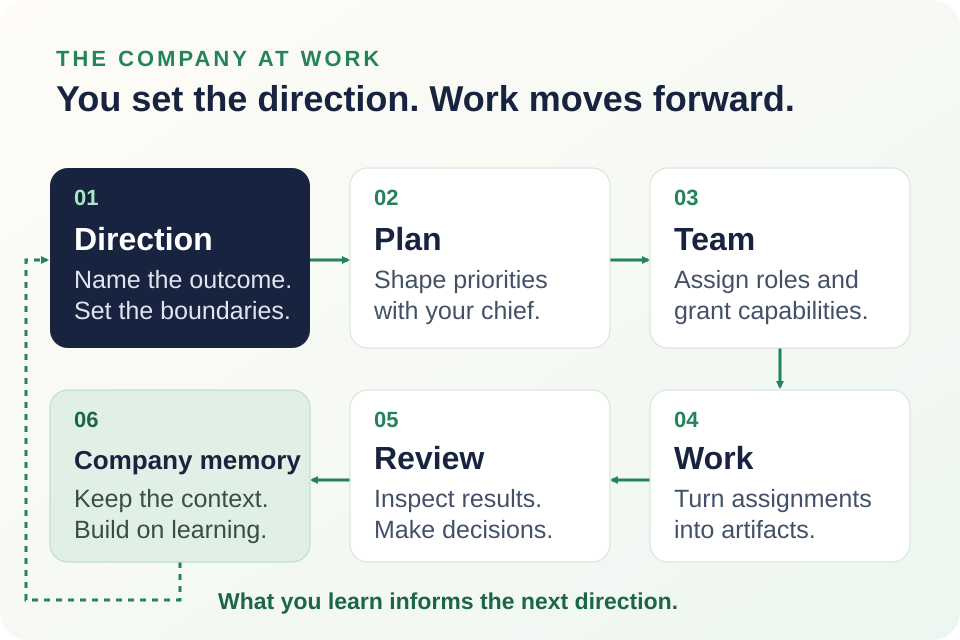
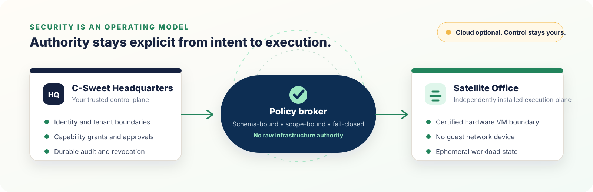

<div align="center">
  
  <h1>C-Sweet</h1>
  <p><strong>Your idea. Your company. Your workforce.</strong></p>
  <p>
    A self-hostable operating environment for agent-first companies.<br />
    Tell your Chief of Staff what you want to build. C-Sweet helps turn that intent into a company that can plan, staff, execute, and improve.
  </p>
  <p><strong>Help build this future.</strong> <a href="https://ko-fi.com/O7F226H4A2">Support C-Sweet's development on Ko-fi.</a></p>
  <p>
    <a href="https://ko-fi.com/O7F226H4A2"></a>
  </p>
  <p>
    <a href="#your-company-your-control"></a>
    <a href="#under-the-hood"></a>
    <a href="#project-status"></a>
    <a href="https://github.com/CrosswiredStudios/csweet/stargazers"></a>
  </p>
  <p>
    <a href="#a-company-can-start-with-one-person">Meet C-Sweet</a> ·
    <a href="#get-started">Get started</a> ·
    <a href="#under-the-hood">Under the hood</a> ·
    <a href="docs/00-product-vision.md">Explore the vision</a>
  </p>
</div>


<div align="center">
  <strong>Lead the company. Give the work somewhere to go.</strong>
</div>

## A company can start with one person

Starting a business should not require you to already know how to run every department.

C-Sweet gives you an executive layer between an idea and the work required to make it real. You act as the CEO: set the direction, define the boundaries, and approve the important decisions. Your Personal Assistant or Chief of Staff helps translate that direction into plans, roles, delegated work, briefings, and deliverables.

Start with an outcome:

> “Research this market, assemble the team we need, and show me the first plan.”

Then give that work a home. Conversations connect to a business. People and agents have roles and reporting relationships. Tasks have owners, work produces artifacts, and decisions become part of company memory.

<picture>
  <source media="(max-width: 600px)" srcset="assets/readme/csweet-company-workflow-mobile.svg" />
  
</picture>

**Direction → Plan → Team → Work → Review → Company memory.** Set an objective, organize the work with your Chief of Staff, assign configured agents, inspect the results, and carry what you learn into the next decision. Execution depends on the agents, providers, and permissions you configure.

## What will you build?

**A software product.** Organize requirements, architecture, implementation, and QA around shared work boards. Brokered Git workspaces and reviewable changes give software assignments a path from a ticket to delivery evidence.

**A game studio.** Bring creative direction, production, and specialist roles into one organization. The catalog spans design, engineering, art, audio, playtesting, and release work; team boards provide sprint planning, capacity, and delivery reporting. Each specialist still needs installation and configuration before it can contribute.

**An operating company.** Keep business objectives, conversations, hiring decisions, approvals, and executive briefings connected. Start with one business and manage additional businesses from the enterprise view as your ambitions grow.

These are ways to explore the current preview, not promises of autonomous business success. The broader vision includes remote agents, human professionals, and hybrid services working together. Today's employee model includes humans and agents; a complete marketplace for engaging every workforce type remains part of that vision. Explore the [example companies and workflows](docs/12-example-scenarios.md) for inspiration.

## Give ambition an operating system

| What you need | What C-Sweet provides today |
|---|---|
| **A clear view of the company** | A CEO command center for objectives, roles, tasks, workers, artifacts, approvals, and next actions; scheduled and on-demand executive briefings. |
| **Work that stays connected** | Durable human and agent conversations with streaming, retry, cancellation, and execution traces; team work boards with Kanban, sprints, estimates, and capacity planning. |
| **A team with responsibilities** | Employee reporting relationships, agent discovery and import, and role-driven hiring recommendations that require owner review. |
| **Deliverables you can inspect** | Artifacts, brokered software workspaces, GitHub pull-request handoffs, and internal Git repositories with proposed changes and governed review/merge workflows. |
| **Knowledge that stays with you** | Persistent company memory, conversation history, decisions, and work records backed by PostgreSQL. Repository and media files use their own configured storage. |
| **Room for creative work** | Configurable image/video generation and editing providers, including local ComfyUI workflows and hosted adapters. Supported operations depend on the provider and its configuration. |
| **Capabilities you can extend** | Agent packages, plugin SDK contracts, communication-provider integrations, and an optional marketplace discovery connection. |

Internal Git hosting gives the company a repository store it can operate itself. The complete offline developer workflow is still in progress; see [internal Git hosting](docs/implementation/internal-git-hosting.md) for implemented behavior and remaining work.

## Start with a team, then make it yours

The [embedded first-party catalog](src/CSweet.Api/first-party-agents.json) currently lists **22 agents**, organized around complementary roles:

| Team | Catalog roles |
|---|---|
| **Executive coordination** | Chief of Staff |
| **Software product delivery** | Product Manager, Software Architect, Software Developer, Software QA |
| **Game direction and production** | Video Game Creative Director, Video Game Producer, Video Game Technical Director |
| **Game design and experience** | Video Game Designer, Video Game Level Designer, Video Game Narrative Designer, Video Game UI UX Accessibility Designer |
| **Game art and audio** | Video Game Art Director, Video Game Artist, Video Game Technical Artist, Video Game Audio Designer |
| **Game engineering and quality** | Video Game Engineer, Video Game QA, Video Game Playtest Researcher, Video Game Build Release Engineer |
| **Specialist operations** | Namecheap Infrastructure Engineer, YouTube Account Manager |

Catalog entries are discoverable source packages, not preinstalled staff or a guarantee of validated end-to-end delivery. Review each agent's repository, license, dependencies, and required capabilities. Source access, import validation, permission approval, provider setup, and a ready Office determine what can actually run.

The optional [C-Sweet Marketplace connection](docs/MARKETPLACE_INTEGRATION.md) adds in-app discovery and Chief-of-Staff capability matching. It is disabled by default; installed and embedded catalog discovery remain available without it. Purchases follow marketplace listing links; automatic entitlement synchronization and a verified install handoff remain future work.

## Your company, your control

**Choose where your company runs.** Self-host Headquarters and its data stores on infrastructure you operate. Connect local or hosted OpenAI-compatible model endpoints; LM Studio is the default local preset, with Ollama and vLLM also described in setup. Model capabilities and endpoint compatibility still matter for agent work.

**Decide what agents can do.** Agents propose actions through a broker. Application-enforced capability grants, tenant scope, approval rules, quotas, and audit records govern their authority. A useful agent is not automatically a trusted principal.

**Keep execution behind a boundary.** Untrusted agent builds and runtimes belong in independently installed C-Sweet Offices using certified hardware-isolation providers. Docker runs trusted development infrastructure such as PostgreSQL. It is not the sandbox for untrusted agents.



The runtime boundary is designed around dedicated virtual machines without a guest network device or host shares. Agents reach approved platform capabilities through the broker rather than receiving database credentials, a Docker socket, or general host access. If no approved Office reports current certification, untrusted execution stays disabled.

Local operation depends on local models, available agent artifacts, and local dependencies. Hosted models, repository imports, marketplace discovery, and external integrations need their respective services and network access. Self-hosting gives you that choice; it does not make every workflow offline.

> [!IMPORTANT]
> Isolation limits exposure; agents can still misuse capabilities you grant. Provider certification checks are not a claim that C-Sweet is production-certified. Review the [runtime threat model](Documentation/Security/AGENT_RUNTIME_THREAT_MODEL.md) and [Office operations guide](Documentation/Operations/DISTRIBUTED_EXECUTION_FLEET.md) before enabling untrusted workloads.

## Get started

The current source-development path is **Windows + .NET + Docker Desktop**, with a separately installed Office for agent execution.

### What you need

- **.NET 10 SDK**, following the version and roll-forward policy in [`global.json`](global.json).
- **Docker Desktop with its Linux container engine running.** Aspire uses Docker for PostgreSQL; `docker info` must succeed before the stack can start.
- **Git** and an **OpenAI-compatible model endpoint**, local or hosted.
- **For untrusted agent execution:** a separately installed [C-Sweet Office](https://github.com/CrosswiredStudios/CSweet.Office) with a supported hardware-isolation provider. The Windows Hyper-V path requires Windows Professional, Enterprise, or Education and hardware virtualization.

### Start your company workspace

1. Clone this repository and start Docker Desktop.
2. Double-click [`Start-CSweet.cmd`](Start-CSweet.cmd). It checks .NET and Docker, attempts to start Docker Desktop when necessary, launches Aspire, and opens the browser.
3. Create the root administrator, save the **ten offline recovery codes**, and complete guided setup for models and optional services. Email is optional.
4. In **Agent Execution** setup, follow the separate Office installation flow. Verify the installer signature, create a one-use enrollment, compare the claimed fingerprint with the Office machine, and approve it. Wait for healthy status and current builder/runtime certification.
5. Create a business and follow onboarding to configure your Chief of Staff and workforce.

For terminal or IDE startup, run the AppHost directly:

```powershell
dotnet run --project src/CSweet.AppHost/CSweet.AppHost.csproj --launch-profile https
```

> [!IMPORTANT]
> The first visitor to a fresh instance can claim the root administrator account. Finish registration and onboarding on a trusted network before exposing the application publicly.

**Docker Compose:** the checked-in topology is an incomplete deployment path for the trusted core, not a supported end-to-end Office execution deployment. Use Aspire and a separately installed Office for current Windows development. See the [Docker infrastructure guide](docs/deployment/docker.md) for persistence, configuration, and limitations.

<details>
<summary><strong>Startup troubleshooting</strong></summary>

Run `docker info` and wait for the engine to report that it is running. An open Docker Desktop window alone does not mean the engine is ready. Starting AppHost directly does not start Docker Desktop for you.

AppHost starts Headquarters services; it does not launch Office. An unavailable Office blocks untrusted execution rather than falling back to a container or host process. See the [debug guide](docs/implementation/debug-guide.md) and [Office fleet operations](Documentation/Operations/DISTRIBUTED_EXECUTION_FLEET.md).

</details>

## Under the hood

Headquarters owns company state and policy. Offices own isolated execution. Trusted source-control services manage repository access and provisioning outside agent guests.

<details>
<summary><strong>Architecture and trust boundaries</strong></summary>

| Component | Responsibility |
|---|---|
| `CSweet.App` + `CSweet.UI` | Blazor web experience and shared UI |
| `CSweet.Api` | Authentication, setup, company operations, conversations, planning, and provider APIs |
| `CSweet.WorkerHost` | Durable background work and execution-fleet orchestration |
| `CSweet.AgentHost` | Policy enforcement and brokered MCP capabilities; no privileged VM lifecycle control |
| `CSweet.ExecutionGateway` | Office enrollment, placement, leases, artifact grants, and broker relay |
| `CSweet.GitHost` | Trusted Git operations, internal repository storage, and brokered workspaces |
| `CSweet.SourceControlProvisionerHost` | Separate trusted service for managed GitHub repository provisioning |
| `CSweet.Migrator` + PostgreSQL | Database migrations, seed data, and persistent company state |
| [C-Sweet Office](https://github.com/CrosswiredStudios/CSweet.Office) | Independently installed execution plane that manages hardware-isolated builds/runtimes and reports capacity and health |

Protocol-v2 executable agents use the transport-neutral SDK, private brokered MCP runtime, and durable work inbox. Runtime guests communicate through Office and ExecutionGateway to the broker; they do not connect directly to company storage or infrastructure.

Read the [MCP runtime architecture](Documentation/Architecture/MCP_AGENT_RUNTIME.md), [Software Developer runtime](Documentation/Architecture/SOFTWARE_DEVELOPER_RUNTIME.md), and [operations runbook](Documentation/Operations/MCP_AGENT_RUNTIME_RUNBOOK.md).

</details>

<details>
<summary><strong>Technology stack and extension points</strong></summary>

- .NET 10, ASP.NET Core, Blazor WebAssembly, and MudBlazor.
- Microsoft Agent Framework and Microsoft.Extensions.AI behind C-Sweet abstractions.
- PostgreSQL and Entity Framework Core; the checked-in Compose database image uses PostgreSQL 17.
- Aspire and Docker for trusted development infrastructure; separate Offices for hardware-isolated agent execution.
- OpenTelemetry foundations, server-sent events for browser streaming, and private Streamable HTTP MCP for agent work.
- Agent SDK and plugin SDK contracts, with communication providers and configurable media-generation adapters.

Explore the [plugin platform](docs/plugin-platform/README.md) and [agent runtime documentation](Documentation/Architecture/MCP_AGENT_RUNTIME.md) to build capabilities that fit the same authority model.

</details>

<details>
<summary><strong>Build and test from source</strong></summary>

Use the SDK selected by [`global.json`](global.json):

```bash
dotnet restore CSweet.sln
dotnet build CSweet.sln --no-restore
dotnet test tests/CSweet.UnitTests/CSweet.UnitTests.csproj
dotnet test tests/CSweet.IntegrationTests/CSweet.IntegrationTests.csproj
```

Local builds automatically detect sibling checkouts for the Agent SDK, Memory, WorkManagement Contracts, and Office Contracts. Without those checkouts, builds use the package versions pinned in [`Directory.Packages.props`](Directory.Packages.props). The switches and paths live in [`Directory.Build.props`](Directory.Build.props).

</details>

## Explore further

| Your next step | Start here |
|---|---|
| Understand the ambition | [Product vision](docs/00-product-vision.md) · [Example companies](docs/12-example-scenarios.md) |
| Set up and operate the preview | [Docker infrastructure](docs/deployment/docker.md) · [Office fleet](Documentation/Operations/DISTRIBUTED_EXECUTION_FLEET.md) |
| Understand authority and execution | [Threat model](Documentation/Security/AGENT_RUNTIME_THREAT_MODEL.md) · [Runtime architecture](Documentation/Architecture/MCP_AGENT_RUNTIME.md) |
| Build on the platform | [Plugin platform](docs/plugin-platform/README.md) · [Implementation plans](docs/implementation/README.md) |
| Find the rest | [Documentation index](docs/README.md) · [Prototype roadmap](docs/09-prototype-roadmap.md) |

Vision, roadmap, and implementation-plan documents include future work; they are not availability guarantees.

## Project status

C-Sweet is an **active developer preview**, not yet production-ready. Core workflows are implemented, while APIs, deployment requirements, and data models may change. `CSweet` is a working name pending final brand and trademark review.

## Help build the company OS

Try a business workflow and tell us where it breaks down. Build an agent or plugin. Improve accessibility, security, documentation, or deployment. Founders, operators, designers, and developers all have a role in making the company easier to lead.

Open a focused [issue](https://github.com/CrosswiredStudios/csweet/issues), explore an [implementation plan](docs/implementation/README.md), or [star the repository](https://github.com/CrosswiredStudios/csweet) to support the project.

---

<div align="center">
  <strong>You bring the ambition. C-Sweet helps you build the company around it.</strong>
  <br /><br />
  <a href="#get-started">Start your workspace</a>
  ·
  <a href="docs/00-product-vision.md">Read the vision</a>
  ·
  <a href="https://github.com/CrosswiredStudios/csweet/issues">Join the conversation</a>
</div>
