# Architecture and reliability comparison

[Assessment overview](README.md) · [Product comparison](01-product-and-workflows.md) · [Improvement plan](03-improvement-plan.md) · [Evidence](04-evidence-and-reuse.md)

Both applications separate business authority from agent reasoning and persist work in PostgreSQL. C-Sweet's distinctive choice is a mandatory independent hardware-isolated execution path for untrusted agents. Paperclip accommodates a wider range of runtimes and deployment boundaries, including a substantial native runner. Borrowing should preserve C-Sweet's authority and persistence invariants.

## Runtime topology

Paperclip has a TypeScript/Express control plane, React UI, Drizzle/PostgreSQL persistence, CLI, adapter packages, plugin SDK and sandbox-provider packages. Its native runner is a separate package with a Rust production implementation, durable transport, provider drivers, normalized sessions, and conformance tools. Describing the September snapshot as simply “Node spawns a CLI” misses significant implementation. Some older architecture documentation is stale: the current server manifest uses `embedded-postgres`, whereas the architecture guide still mentions PGlite. Use current implementation when these disagree. [P01, P02, P03, P12](04-evidence-and-reuse.md#source-register)

C-Sweet splits Blazor UI, API, worker and agent hosting, trusted source-control services, execution-gateway/fleet responsibilities, and independent Office services. The .NET SDK hides transport, leases and runtime credentials behind typed callbacks and platform clients. The main app and selected sibling repositories collectively define the product; a main-repository-only comparison would omit major execution and memory capabilities. [C01, C02, C08](04-evidence-and-reuse.md#source-register)

```mermaid
flowchart TB
  subgraph PC[Paperclip conceptual flow]
    PU[React UI and CLI] --> PA[Control plane and PostgreSQL]
    PA --> PR[Adapter or native runner]
    PR --> PE[Local or provider sandbox environment]
    PE --> PG[Authorized task and tool APIs]
    PG --> PA
  end
  subgraph CS[C-Sweet conceptual flow]
    CU[Blazor UI and Communications] --> CH[Headquarters policy and PostgreSQL]
    CH --> CG[Signed assignments and execution gateway]
    CG --> CO[Independent Office and RuntimeHost]
    CO --> CV[Certified hardware-isolated guest]
    CV --> CB[Brokered capabilities]
    CB --> CH
  end
```

This diagram summarizes responsibilities, not every service connection. A box labeled sandbox does not establish the same isolation or networking rules in both systems.

## Security and authority

### Paperclip

Paperclip distinguishes loopback `local_trusted` operation from authenticated private/public exposure. Source includes company/user authorization, secret bindings, tool gateway policy, permission checks, and low-trust workspace validation. `assertLowTrustWorkspaceIsolation` requires an isolated workspace, the correct issue boundary and the sandbox driver for a low-trust run. The native runner still applies company and task authority even when provider permission defaults are permissive. [P12, P13](04-evidence-and-reuse.md#source-register)

Its sandbox requirements explicitly leave provider isolation and general internet policy to the provider/operator and state that externally supplied provider assumptions cannot be verified by the repository. This is a narrower assurance statement than a uniform no-network hardware-guest policy. The local adapter boundary is different again. The correct evaluation unit is **a specific adapter, environment, permission profile and deployment**, not Paperclip as a single security mode.

`plugin-runtime-sandbox.ts` implements a Node VM loader with module allowlisting and capability-scoped invocations. That mechanism should not be described as equivalent to Office hardware isolation or taken as a complete security assessment of plugin execution. No exploit testing or comprehensive audit was performed.

### C-Sweet

Office separates an unprivileged Node service from a privileged RuntimeHost. Its documented and wired architecture verifies signed assignment identity, provider, workload specification digest, expiry and fencing epoch, persisting replay state before provider creation. Guests are designed without a virtual network adapter or host shares; brokered access mediates approved capabilities. Current provider readiness/certification is required, and ordinary process/container execution is not an automatic fallback. [C02](04-evidence-and-reuse.md#source-register)

This is a strong architectural differentiator for untrusted third-party agents, with costs in installation, guest images, diagnosis and portability. It does not establish production certification, eliminate host-admin trust, or prevent agents from misusing capabilities intentionally granted to them. C-Sweet's README accurately states these limits. Preserve them when marketing the comparison.

**Borrow:** clearer trust/readiness explanations and preflight checks. **Retain:** signed assignments, current grants, independent privileged verification and the guest boundary. **Do not transplant:** a convenient local adapter directly into Headquarters as a workaround for Office setup.

## Work ownership and state transitions

Paperclip's `issueService.checkout` validates the assigned agent, subtree holds and dependencies, then conditionally updates the issue using expected status, assignee and execution-run conditions. This is concrete protection against two runs claiming the same work. Review policy and execution decisions add further transition constraints. [P04](04-evidence-and-reuse.md#source-register)

C-Sweet already has equivalent classes of mechanisms: `AgentWorkInbox` uses installation-scoped idempotency, payload hashes, attempt/lease identity, bounded payloads and PostgreSQL advisory locking for claims. Board execution pins policy revisions and records stages and attempts. The canonical work item has revision fields, dependencies, mutation receipts and one operational board. [C03](04-evidence-and-reuse.md#source-register)

The useful borrowing is a **failure matrix**, not another queue:

| Race or failure | Required C-Sweet outcome |
|---|---|
| Two executors request the same work | Only one current attempt acquires authority. |
| Old executor finishes after lease replacement | Its stale completion cannot advance the replacement's work. |
| Same idempotency key arrives with different content | Reject it rather than returning an unrelated success. |
| Human changes policy or grants during a wait | Revalidate current authority before dispatch or consequential action. |
| Review response targets an old artifact revision | Keep the newer revision unapproved. |
| Merge succeeds but the response is lost | Recover the same receipt and exact source/target identity. |

These scenarios complement existing C-Sweet tests. A static read does not prove every path satisfies them.

## Durable events and recovery

Paperclip has persisted wake requests, durable chat actions, recovery provenance and native safe-replacement logic. `durable-chat-wakeup.ts` specifically separates accepted-response publication from permission to execute or repair a provider session. The adapter result contract includes positive recovery evidence such as provider work not having started or a stopped, preserved session with settled action outcomes. These are valuable patterns for avoiding unsafe replay. [P02, P03](04-evidence-and-reuse.md#source-register)

Paperclip's `live-events.ts`, separately, uses a process-local `EventEmitter` and incrementing counter. It is a live-notification mechanism, not itself a durable event log or cross-process bus. That does **not** mean all Paperclip work is volatile; the durable work paths above must be evaluated independently. Multi-replica fan-out and reconnect behavior deserve deployment-specific testing.

C-Sweet's communication and application realtime outboxes persist changes with notification records, use stable IDs and reconcile authorized current state after reconnect. Platform events target current authorized installations. `AgentAttentionScheduler` adds reconnect/periodic/invalidated wake hints, and intentionally does not accumulate every missed interval while an Office is offline. The SDK's bounded polling for acknowledged inference transport is distinct from agents repeatedly polling business state; preserve that distinction. [C05, C06, C08](04-evidence-and-reuse.md#source-register)

**Recommendation:** Keep C-Sweet's transactional outboxes and authoritative reads. Extend recovery evidence so operators can distinguish “safe to retry,” “work may still be running,” “external outcome unknown,” and “human decision required.” A timeout is not proof that an external side effect did not happen. Recovery actions should bind to the failed attempt, evidence and permitted scope, with a bounded retry budget.

The local project-health changes already implement incidents, deduplication, timed manager handoffs and human delivery. They deliberately do not grant repair/restart authority. Treat richer recovery actions as a carefully separated future authorization feature, not an implied extension of monitoring. [C10](04-evidence-and-reuse.md#source-register)

## Budget enforcement and accounting

Paperclip's `costService.createEvent` records a cost event, updates spend aggregates and invokes `budgetService.evaluateCostEvent`. Policies cover company, agent and project, with warning/hard thresholds and monthly/lifetime windows. Hard stops create incidents, pause the affected scope and invoke cancellation hooks. `heartbeat.ts` checks `getInvocationBlock` before invocation. Inspected tests cover exceeded budgets, company pauses, project stops and authorized budget increases. [P08](04-evidence-and-reuse.md#source-register)

This is useful evidence of a spend-control loop, but **not a proven zero-overspend guarantee**. The inspected mechanism uses observed cost. Parallel work, delayed provider usage and cancellation latency can produce additional charges before a stop takes effect. The README's broad atomic-budget claim should not substitute for a demonstrated reservation mechanism at every paid execution boundary.

C-Sweet's `WorkforcePlatformCapabilityHandler.EvaluateBudgetAsync` does have budget evaluation and optional reservations. It sums active reservations, chooses the most restrictive available budget and can persist an idempotent reservation. However, the inspected `PlatformLlmCapabilityHandler` focuses on provider/output limits, granted model access, dispatch and usage capture. `PlatformLlmJobService`'s `budgetGate` controls in-process job admission/accounting; its name does not establish monetary enforcement. No complete currency-based reservation/settlement path was established for model calls. [C04](04-evidence-and-reuse.md#source-register)

Two targeted implementation questions deserve tests before advertising a hard financial cap:

1. Can simultaneous reservations oversubscribe the same limit? The inspected evaluation method reads then inserts; cross-request serialization is not visible in that method. This is a verification concern, not a confirmed exploit.
2. Are all applicable scopes charged and settled, including organization plus project/employee, retries, enrichment and unknown usage? Reserving only one selected budget requires careful accounting across the others.

C-Sweet's inference analytics are a strong base: provider receipts preserve attribution snapshots, token subcategories are not double-counted, missing usage has coverage semantics, and active effort differs from elapsed duration. Build monetary policy alongside these facts. Do not turn unknown consumption into zero or make ordinary telemetry success the sole condition for financial authorization. [C04, C11](04-evidence-and-reuse.md#source-register)

## Context, memory and reusable procedures

Paperclip separates runtime session continuity, instruction revisions, company skills and optional knowledge integrations. Its Skill Studio makes editing and testing procedures a product workflow. The native runner stages assigned skills in controlled runtime context and refreshes them when reopening a provider. [P02, P03, P09](04-evidence-and-reuse.md#source-register)

C-Sweet integrates conversational recall/capture with employee, relationship and organization namespaces. Its sibling memory framework documents immutable episodes, provenance-bearing claims, temporal relationships, hybrid retrieval and approval-gated knowledge transfer. These framework capabilities should not be confused with proof that every corresponding UI flow exists in C-Sweet. The app's `AgentMemoryService` does establish actual recall and use-record integration. [C07](04-evidence-and-reuse.md#source-register)

Borrow the **procedure lifecycle**: draft, test against fixed examples, review, approve a version, deploy it to selected roles, inspect outcomes and roll back. C-Sweet's existing curated-playbook plan already proposes this on procedural memory. Build there rather than introducing a competing skill-memory database. Prompts and playbooks may guide behavior; only current platform grants confer authority. [C11](04-evidence-and-reuse.md#source-register)

## Portability and extensibility

Paperclip company portability includes previews, resource manifests, environment inputs, hashes, collision strategies and safe agent-import restrictions. Sensitive environment names and secret references become required inputs rather than raw secret exports; safe import refuses replace-style collisions. This is a practical reference for **review before mutation**. It does not guarantee arbitrary user-authored documents or instructions contain no secrets. [P06](04-evidence-and-reuse.md#source-register)

C-Sweet should export a declarative business template: objective/profile, logical roles, package pins, required capabilities, initial workflow, artifact templates and evaluation fixtures. Exclude runtime identities, active grants, enrollments, credentials and private history. Import should resolve logical references, preview changes and missing prerequisites, and create dormant resources through canonical services. Benchmark blueprints offer useful internal precedent, but they are not a ready general export format. [C08, C11](04-evidence-and-reuse.md#source-register)

Paperclip's adapters also demonstrate a valuable separation of execution, diagnostics, result normalization, session metadata, usage basis and UI configuration. Reimplement those responsibilities within a C-Sweet Office-compatible bridge if needed. Do not copy an adapter's credential/host-process behavior wholesale into the broker.

## Engineering quality and maintainability

Paperclip's test assets cover much more than unit behavior: release install paths, Storybook screenshots, runner replay/conformance, restart faults and browser interactions. Their existence and workflow wiring support an engineering-process advantage; their pass rates were not measured here. The main C-Sweet repository contains substantial tests, including SQL-specific invariants, but its sole inspected GitHub Actions workflow only runs for selected distribution-related PR changes, manual dispatch and tags. Sibling repositories have separate release workflows, so this finding is about the main platform's checked-in automation. [P11, C12](04-evidence-and-reuse.md#source-register)

Borrow a small enforced test pyramid: fast deterministic contract/authorization tests on every platform PR; package-only builds; isolated PostgreSQL concurrency tests; a small browser journey; scheduled Office recovery/acceptance runs. Add visual fixtures for queue, chat, artifacts, empty/loading/error states and narrow screens. Do not start by reproducing every Paperclip CI lane.

Paperclip's very large orchestration files and C-Sweet's multi-service/multi-repository version coordination are different maintenance risks. Each should be managed directly. Language or framework choice does not establish reliability; clear contracts, bounded state machines, compatibility checks and observable recovery do.
