# Producer: vision to completed delivery

Reviewed: 2026-09-24 Pacific / 2026-09-25 UTC.

Status: source implementation, deterministic regression verification and local package validation are complete; deployed-runtime acceptance remains a rollout step. The investigation below records the original failure; see the implementation record at the end for the changed behavior and rollout boundary.

## Finding

At the time of the investigation, Gabriel Reyes had two disconnected workflows: a direct-chat proposal generator and a
formal creative-handoff production pipeline. The former can propose a project and staffing, but
cannot transition those results into the latter. Fluent chat responses conceal this missing
continuation. The reported failure is supported by both the conversation and persisted records;
it is not explained by the user failing to provide a formal pitch or repeating an instruction.

The required behavior is a persistent delivery coordinator. Given an actionable vision, the
Producer retains the goal, obtains any required approvals, establishes the project and team,
coordinates technical decomposition, gets canonical work assigned and running, and continues
through accepted increments until the project outcome is verified. The user should intervene for
actual decisions, authority limits, and exceptional blockers, not to move work between these steps.

## Observed conversation and state

The review read the local application's conversation and database without modifying live records.
Times below are UTC on September 25 (the preceding evening in Pacific time).

| Time | User direction / agent response | Persisted result |
| --- | --- | --- |
| 04:29 | Create a visually appealing Breakout clone project and suggest a lightweight team. | The first turn returned the no-response fallback. |
| 05:00 | Repeat the project/team request. | A project proposal and separate four-role staffing proposal were submitted. |
| 05:02 | Use just an architect to plan tickets and a developer to implement them. | A two-role staffing proposal was submitted and subsequently approved. |
| 05:06 | Work with Victor, populate the Kanban board, assign work, and start the sprint. | Gabriel returned a ten-ticket Markdown table and promised to create the cards. No project board, cards, or sprint resulted. |
| 05:16 | Victor is hired; start planning and create the tickets. | Gabriel again claimed he was creating ten cards and starting the sprint. No persisted project work resulted. |
| 05:19 | Add Victor and Daniel to the project. | Gabriel submitted another staffing proposal, without a project ID or the existing team ID. |

Verified during this review:

- Installed Producer: `2.8.7`.
- Conversation: `0a0c5318-0b80-4293-936e-e8b11e780fc4`.
- Gabriel: `05577d16-0e33-4bf8-bb45-b2569bc61e26`.
- Breakout FX Demo: `9a019401-e21c-4547-a7ab-2e1929e0a59a`, status `Approved`, revision 1.
- Project proposal `2a44fb74-bb8e-4305-b57d-c1f4bd73fee1`: approved.
- Two-role staffing proposal `95e9435e-2e5f-4880-9be6-a4786abeeebd`: approved.
- Team `19a7bf99-7ba6-40cc-a5b9-da46dfd3a140`: Gabriel, Daniel Kim, and Victor Lin are active members.
- No `WorkstreamTeamAssignments` join attaches this team to the project.
- Zero project boards, zero project-board tickets, and zero sprints.
- Latest staffing proposal `9b3ae9cd-4c11-4740-aebd-92170feb64ac`: pending, with null
  `TeamId` and `WorkstreamId`. It references the previous approved staffing request, but that
  lineage does not attach the existing team to the project.

The immediate missing step is **project/team/participant binding**, not hiring Victor or Daniel again.
The later planning and delivery gaps would still prevent completion after repairing that binding.

## Root causes and code map

Paths under Producer refer to sibling `CSweet.Agent.Producer.VideoGame`; other sibling repositories
are named explicitly. Symbols are the stable navigation references.

### 1. Chat claims are not backed by operations

Producer `ManagerChat.cs`, `HandleManagerMessageAsync`, asks the model for only `response`,
`createProject`, `projectName`, `projectOutcome`, and `teamRoles`. The handler can call
`ProposeManagerProjectAsync` and `ProposeManagerTeamAsync`. It cannot bind participants, request
technical planning, publish tickets, assign work, or start a sprint from the chat request.

The model's free-form response is committed directly, even when it describes those unimplemented
actions as in progress or confirmed. The prompt says not to claim mutations without results, but
the program does not constrain the final answer to actual results. Appending an approval receipt
does not correct contradictory promises in the model text.

`ManagerTurnPlan` needs explicit supported intents; a model draft must never serve as an execution
receipt. Persist the requested continuation before promising that future work will happen.

### 2. Conversation, project identity, and ongoing intent are not retained together

`HandleManagerMessageAsync` sends the system prompt and current `incoming.Message` only. It does
not call `Communication.ReadChatAsync`, retain a manager kickoff, or read current portfolio,
resource-change, board, and sprint state before answering.

The host adds authoritative employee/team identity to model instructions, which can explain some
name awareness; that is not the missing conversation history or a verified project assignment.
`PlatformLlmCapabilityHandler.ResolveMessagesAsync` converts submitted messages and resolves media.
It does not reconstruct missing conversation history.

`ProducerOperatingState` stores accepted handoffs and planning cycles, but no durable linkage from
this lightweight conversation to its project proposal, staffing request, selected team, approved
scope, delivery authorization, or next pending action.

### 3. Project approval, team approval, and participant setup are disconnected

`ProposeManagerProjectAsync` takes its initial team from the current identity. On first kickoff
there is no team, so the approved project has none. `ProposeManagerTeamAsync` uses a turn-derived
team key and does not bind `WorkstreamId` or preserve the approved team's ID on follow-up requests.

Host `ResourceChangeService.ResolveApprovedTeamAsync` establishes the approved team; it does not
perform project setup. `WorkstreamManagedActionExecutor.CreateAsync` establishes an initial team
assignment only when the original proposal included that team. No later Producer step joins the
separately approved results. A membership request is misclassified as a staffing proposal,
although the employees already exist.

This cannot be fixed merely by calling today's human membership endpoint as the agent:

- `ProjectSetupService.RequireManagerAsync` accepts authorized humans, not agent callers.
- `ProjectSetupService.ValidatePeopleAsync` recognizes a human or a declared
  `software-product-manager` as manager, excluding this Producer's declared role.
- `ProjectSetupService.ProvisionApprovedAsync` returns early without explicit `participantIds`;
  the lightweight Producer profile does not supply them.
- That provisioner also hard-requires architect, developer, and software QA for an agent manager.
- `WorkstreamManagedActionExecutor.ApplyChanges` does not accept team or participant fields.

Add an explicit governed agent setup operation with current project/team/participant checks.
Do not broaden a human-only endpoint indiscriminately or use a staffing request as a substitute.

### 4. Background discovery misses accountable-manager projects

Producer `HandleAttentionReviewAsync` builds candidate project IDs from `Identity.ManagedWorkstreams`
and `AcceptedHandoffs`, then returns early when that set is empty. `AgentEmployeeIdentityResolver.ResolveAsync`
fills `ManagedWorkstreams` from supervision rows. The lightweight proposal supplies no initial
supervisors and retains no handoff.

An accountable-manager project can therefore be skipped before any portfolio read happens.
The broker's `WorkstreamGovernanceCapabilityHandler.ReadPortfolioAsync` already supports current
accountable-manager visibility; discovery should use that authority rather than interpreting a
supervision-only identity field as the complete management portfolio.

### 5. Lightweight intake cannot enter the existing planning contract

Producer `ReconcilePlanningAsync` requires `AcceptedHandoffs`, an accepted planning package, and
accepted artifact revisions. Missing state produces "The exact Creative Director handoff is no
longer available." `HandleAttentionReviewAsync` schedules initial planning only for accepted
handoffs with a project team.

Technical Director `ProductionPlanning.cs`, `HandleCoordinationTurnAsync`, independently checks
the accepted package and its exact digest. The Producer cannot invent one to bypass that check.
The direct-chat path creates neither this evidence nor an alternate supported planning input.

Provide a manager-authorized, revisioned brief as a first-class planning input. Preserve the formal
creative-handoff path for projects that choose it. A short owner request must not be relabeled as
a Creative Director acceptance. Adapt both technical planning implementations to the manager-brief
contract or explicitly negotiate their existing supported planning protocols.

### 6. The two-person team and lightweight profile are not executable under current policy

The lightweight profile `profiles/video-game-manager-brief.v1.json` declares lifecycle stages and
a `general-work.v1` board, but no delivery orchestration or assignment policy. The formal path's
`EnsureProductionBoardAsync` selects `video-game-production-board.v2` and attempts to configure
profile orchestration. `WorkOrchestrationService` requires a published policy for start.

`ReconcileEstimatesAndQaReadinessAsync` requires a dedicated QA teammate and a `Ready` column.
Technical Director `ProductionPlanning.cs` requires engineering and QA leaves. Existing delivery
acceptance also expects the evidence prescribed by the formal pipeline.

Gabriel agreed Victor could perform per-ticket review, but no corresponding lightweight review
policy was selected or implemented. An architect and a QA role are not interchangeable merely
because the model says so. A lean policy can use developer execution, independent technical review,
and Producer acceptance where adequate for the project. It must name the real reviewer, validate
supported capabilities, and preserve any genuinely required specialist gates.

Core-role compatibility helps select game/software peers, but does not translate their different
planning, estimation, execution, and review artifact protocols. Test both the Technical Director
implementation and the Software Architect implementation explicitly.

### 7. Continuation and completion are incomplete

Useful machinery already exists: canonical backlog publication, assignment refresh after hiring,
estimates, preflight, orchestration start, delivery review, and planning the next increment when
reconciled backlog remains. `WorkOrchestrator` completes a sprint when all its executions are
terminal. Reuse these components.

However, Producer `HandleEventAsync` treats resource-change decisions and `sprint.completed` as
status-report events rather than immediately reconciling the missing next step. The orchestrator
records `sprint.execution.completed` in its own event ledger; that alone is not proof of delivery
to the Producer's subscribed `sprint.completed` event. Verify and bridge the actual durable wake
path. Retain bounded discovery to recover missed notifications.

No lightweight path connects final delivery evidence to closure of the project outcome. An empty
backlog, a chat response, and a completed sprint are different facts from an accepted project.

### 8. Tests verify fragments, not the user's journey

All **100 existing Producer tests pass** with published SDK references:

```powershell
dotnet test -p:UseLocalCSweetAgentSdk=false --verbosity minimal
```

`ManagerChatTests.DirectManagerRequestProducesFinalAnswerAndGovernedProjectProposal` verifies
proposal calls and a final response. It does not run approval, hiring fulfillment, project
attachment, planning, assignment, or execution. Existing adaptive-delivery and planning tests
cover useful helpers and formal-handoff cases, but do not establish this full journey.

## Proposed operating contract

```mermaid
stateDiagram-v2
    [*] --> BriefRetained
    BriefRetained --> SetupPending
    SetupPending --> ProjectReady: project and staffing authorized; participants attached
    ProjectReady --> Planning: technical lead available
    Planning --> SprintReady: backlog, assignments and readiness verified
    SprintReady --> Running: preflight and execution receipt
    Running --> IncrementReview: execution terminal
    IncrementReview --> Planning: accepted increment; remaining scope
    IncrementReview --> Running: remediation authorized
    IncrementReview --> CompletionReview: goal coverage complete
    CompletionReview --> Completed: acceptance and closure recorded
    Completed --> [*]
```



Every stage can expose a precise waiting condition, its responsible party, and a durable wake
source. Reject/cancel/scope-change paths retain lineage and stop obsolete downstream actions.
Events are hints to reread current authorized state, never execution grants. Simultaneous chat,
event, and reconnect work must converge on the same domain records.

Retain at least: source conversation/message and manager identity; brief revision and constraints;
project proposal/project IDs; current staffing proposal/team ID; selected employee IDs; setup
receipt and grants revision; planning protocol/session/revision; backlog provenance; current
sprint/execution IDs; requested delivery scope; approval boundaries; wait reasons and wake
correlation; final outcome evidence. Keep authoritative facts in existing platform records and
store references/progress in Producer state rather than creating a second board.

## Implementation sequence

1. **Truthful chat and durable intake.** Read bounded authorized history and current state, retain
   the manager's outcome and continuation request, distinguish hiring from assigning existing
   people, and return completed actions/pending actions/blockers from typed operation results.
   Reuse recorded approvals; disclose unsupported actions rather than narrating work in progress.
   Current message IDs and stable project IDs bind retries.
2. **Governed setup and recovery.** Resolve the approved project and team; attach explicit
   participants, board, grants and project-delivery binding under project authority. Persist
   changes and outbox notifications atomically. Validate tenant, accountable manager, approved
   staffing, active installations, team exclusivity, concurrent revisions, and replay keys.
   Handle project-first, team-first, delayed-hire, and restart orderings. Membership changes must
   not create new hiring requests unless there is an actual uncovered role.
3. **Manager-brief planning and executable lean policy.** Implement revisioned brief grounding,
   technical-lead protocol selection, backlog proposals with hierarchy/dependencies/acceptance
   criteria, canonical publication, and role/capability-based assignment. Let the technical lead
   own decomposition. Pin a compatible delivery policy for the chosen team; optional specialists
   must be driven by work requirements. Do not silently grant approval, assume a repository
   exists, or equate a roster role with a protocol implementation.
4. **Start, review, and continue.** Run readiness checks, request supported specialist estimates
   where policy requires them, start real orchestration, review actual artifacts, schedule the
   next dependency-consistent increment, handle rework and blockers, and obtain outcome acceptance
   before closure. Choose cadence for the actual team; do not impose a two-week human schedule on
   an all-agent team. Use durable completion/hiring/decision wakes, with authorized bounded
   recovery reads when notifications are missed.
5. **Existing-project migration and release.** Recover Breakout FX Demo from its approved project,
   approved team and hired employee IDs. Reconcile the redundant pending staffing request through
   its supported lifecycle rather than creating a duplicate team. Surface genuinely missing
   authority once. Preserve published profile pins through an explicit upgrade path. Update SDK
   and shared contract package versions/pins if public APIs change; bump every changed agent
   before writing matching release notes. Test and pack changed packages using published
   dependency resolution before activating them.

## Acceptance scenarios

The primary test must start with the user's short Breakout brief and an initially empty team.
Use deterministic model/tool fixtures for assertions and a separate live smoke test for actual
model behavior. Success is determined by persisted artifacts and execution, never by phrases
such as "on it" or a Markdown ticket table.

| Scenario | Required evidence |
| --- | --- |
| Vision intake | One retained brief and correlated project/staffing intent; no mandatory Creative Director. |
| Revise four-role proposal to two roles | One current plan; prior request lineage retained; no extra team or stale-role hires. |
| Project approval before team approval, and the reverse | Both orders converge to the same project/team/participant binding. |
| Existing Victor and Daniel | Reuse actual employee/installation IDs; zero duplicate hires; active project membership and effective grants. |
| Technical planning | A real coordination session with the selected technical lead; its current proposal creates canonical tickets. |
| Start first sprint | Nonempty dependency-consistent scope, exact eligible assignments, compatible pinned policy, passing preflight, and active execution ID. |
| Continue to second sprint | Completion/acceptance of the first increment triggers the next one without a new user prompt. |
| Finish project | Required outcome criteria have evidence and required acceptance; project becomes completed exactly once. |
| Restart / lost event / duplicate or out-of-order event | Recovery converges without duplicate projects, staffing proposals, tickets, sessions, or sprints. |
| Rejected approval / removed member / revoked grant / changed brief | Affected work waits or is superseded; independent authorized work continues; stale work never executes. |
| Technical Director and Software Architect variants | Both use an explicitly supported planning and review protocol. Role aliasing alone is insufficient. |
| Denied or failed operation | The user receives the failed step and retained next action; no false claim of tickets, assignments, or execution. |

Do not label the complete producer lifecycle repaired until the multi-sprint scenario passes
against real platform services and the existing live project can resume through supported
application operations. The original investigation changed no runtime behavior, approvals, hires, memberships,
project data, installed packages, or live execution.

## Implementation record

The repair is implemented across Producer 2.9.0, Technical Director 2.11.0, Software Architect
0.17.0, SDK 3.56.0 and Core. This is a source change; the installed agents and live Breakout project
have not been modified by this implementation work.

- `ManagerChat.HandleManagerMessageAsync` reads retained conversation and authoritative portfolio
  and staffing state. It reuses existing approvals and emits mutation results instead of model-written
  completion claims. New approved project metadata retains the original manager direction.
- `ProjectSetupService.PrepareDeliveryAsync`, exposed by `Platform.Projects.PrepareDeliveryAsync`,
  validates current approval, accountable manager, routine staffing authority, team and participants.
  It atomically creates the team/project link, board, scoped grants and assignment outbox. Replay
  does not hire, move people, restore removed participants, or reissue grants.
- `ManagerDelivery.AdvanceManagerDeliveryAsync` owns the durable brief-to-sprint continuation.
  It validates `ProjectDeliveryPlanning` artifacts from either supported technical lead, publishes
  canonical tasks and sprint scope with stable keys, finalizes source delivery and assignments,
  then preflights and starts each sprint. Finished executable work closes the grouping tickets and
  submits the profile's governed completion transitions; required approvals are retained.
- Manager-brief profile version 2 defines developer execution, independent technical review,
  Producer acceptance/authorization and trusted merge. The quality reviewer inspects actual
  developer test results; it never represents them as tests independently executed by the reviewer.
  Exact candidate and merge policy checks remain in Core. Formal GDD-based production is unchanged.
- `WorkOrchestrator` persists a project-bound sprint completion wake with the state transition.
  `RepositoryProvisioningProcessor` persists targeted completion/failure wakes. The Producer also
  recovers accountable projects on attention review and keeps a durable missed-event recovery wait.

Rollout order: publish SDK 3.56.0; deploy Core; import the new Producer and selected technical lead
revisions and approve their declared grants. For Breakout, Gabriel can reuse the existing approved
two-person team and project via the new setup operation. Its empty version-1 project needs the
separate execution-profile upgrade approval before tickets execute. Required repository, merge and
final lifecycle approvals remain governed. Installed-provider and live project acceptance are still
rollout checks; passing deterministic tests does not establish that the currently installed Gabriel
has been updated.

## Verification record (2026-09-25)

- SDK solution: 271 SDK tests and 2 sample tests passed with packaged Work Management contracts.
- Producer: 106 tests passed against the packed SDK with sibling SDK references disabled. This
  includes two successive sprints using either supported technical lead, reconstructed agent
  instances, duplicate reconciliation, preflight denial, missing staffing approval, active execution
  blockers and chat failures. The journey uses deterministic typed capability fixtures; it is not
  a deployed end-to-end execution or a real-model acceptance run.
- Technical Director: 36 tests passed; Software Architect: 36 tests passed. Both used the packed SDK.
- Core: 156 targeted Release tests passed (3 existing tests were skipped) with sibling SDK references disabled. These exercise real
  services for setup, exact-participant replay, permission denial, profile upgrade validation,
  provisioning wakes, sprint completion wakes, source review/merge authorization and policy validation. A real broker regression also verifies that
  generated setup grants support the published profile, metrics and manager-only grouping-ticket
  closure, while rejecting unfinished children, executable completion shortcuts and a different manager.
- All three agent self-tests passed. Temporary standalone template generation passed its 7 tests
  and self-test using SDK 3.56.0.
- Packed SDK 3.56.0, Producer 2.9.0, Technical Director 2.11.0 and Software Architect 0.17.0 into
  `.artifacts/producer-delivery/packages`. Verified each NuGet filename and metadata version,
  packaged agent manifest version, SDK dependency pin and both Producer profile assets.
- Core build retained the existing Office.Contracts NU1902 dependency warning and nullable warnings
  in Communications.razor. No new build errors or test failures remain in the checks above.

No packages were published, installed agents updated, approvals applied, or live work started.
The rollout must confirm the new immutable revisions and effective grants, approve Breakout's
version-1 profile upgrade, then exercise the real provider and execution path. The pending duplicate
staffing request from the investigation should be reconciled through its supported UI lifecycle;
it was not silently rejected during source implementation.